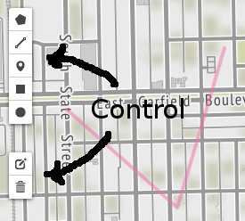
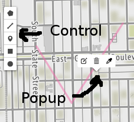

leaflet-draw-toolbar
====================

[Leaflet.toolbar]: https://github.com/Leaflet/Leaflet.toolbar
[Leaflet.draw]: https://github.com/Leaflet/Leaflet.draw

This Leaflet plugin provides [Leaflet.toolbar][]-based toolbars for
Leaflet.draw. There are two different styles of toolbars:
control-style (fixed relative to the window), and popup-style (attached to a
latlng on the map). Here's what they look like:




Popup-style toolbars provide a natural way for users to interact with features
drawn on the map.

Interactive examples:

  - [control-style toolbar](examples/control.html)
  - [popup-style tooblar](examples/popup.html)

The toolbars in this library are interoperable with the toolbars in
Leaflet.draw, so both can be used on the same webpage (see 
[example](examples/combined.html).

For more information on Leaflet.toolbar, see the [API Reference](https://github.com/leaflet/Leaflet.Toolbar/wiki/API-Reference) and [Building custom toolbars](https://github.com/leaflet/Leaflet.Toolbar/wiki/Building-custom-toolbars) on the wiki.

Usage
-----

Include Leaflet.toolbar and this library: `npm install leaflet-toolbar leaflet-draw-toolbar`.

You can then include Leaflet.Toolbar in your web application by adding the following HTML tags (paths below are relative to your project's root):

```
<script src="node_modules/leaflet-toolbar/dist/leaflet.toolbar.js"></script>
<script src="node_modules/leaflet-draw-toolbar/dist/leaflet.draw-toolbar.js"></script>
<link rel="stylesheet" href="node_modules/leaflet-toolbar/dist/leaflet.toolbar.css"/>
<link rel="stylesheet" href="node_modules/leaflet-draw-toolbar/dist/leaflet.draw-toolbar.css"/>
```

To add a toolbar for drawing on the map with Leaflet.draw:
```javascript
new LeafletToolbar.DrawToolbar({
    position: 'topleft'
}).addTo(map);

```

To add a control-style toolbar for editing features drawn on the map with Leaflet.draw:
```javascript
new LeafletToolbar.EditToolbar.Control({
    position: 'topleft'
}).addTo(map, drawnItems);
```
Note that `drawnItems` is the `L.Layer` containing the items drawn on the map.

To add a popup-style toolbar for editing features drawn on the map with Leaflet.draw:
```javascript
new LeafletToolbar.EditToolbar.Popup({
    position: 'topleft'
}).addTo(map, drawnItems);
```
Note that `drawnItems` is the `L.Layer` containing the items drawn on the map.

Development
-----------

Run `grunt`. This will launch a PhantomJS headless browser and watch for
changes. When you change a file, the JS and CSS will be linted, tested,
and rebuilt.

Note: This package is based on [Leaflet.draw#354](https://github.com/Leaflet/Leaflet.draw/pull/354).
